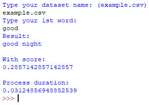
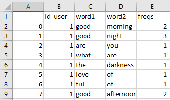

# next-word-prediction
A simple text-based next word prediction using Naive Bayes
  

### Prerequisites
- Python 3
- Pandas library

### Usage
1. Create your dataset like this: (you can see in example.csv) 
 
note: you can use my dataset in instagram-post-crawler repo (for Indonesia language)
2. Run ``nextwordpredicion.py``
